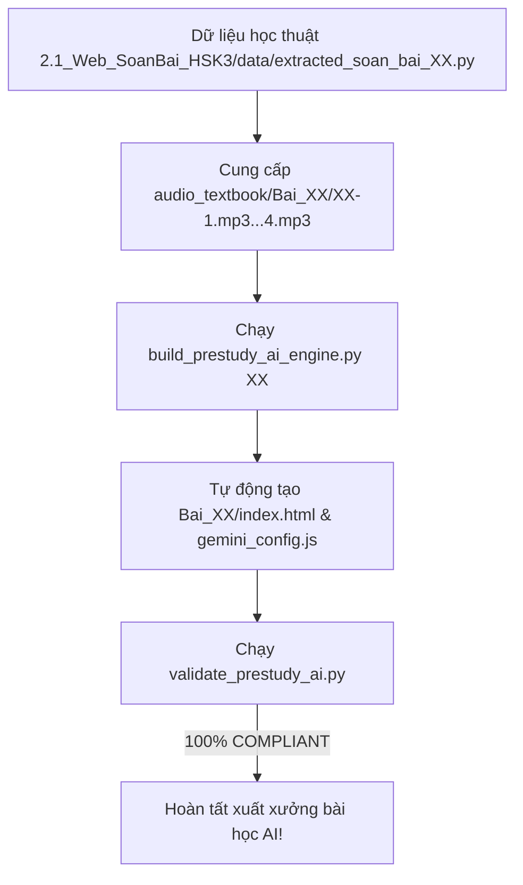

# HSK 3 PRE-STUDY AI BUILDER SPECIFICATION (PHIÊN BẢN 2.1)
## Quy Chuẩn Kỹ Thuật & Sư Phạm Web Soạn Bài Trước Tích Hợp AI Vision

Tài liệu này là **quy chuẩn kỹ thuật, thiết kế giao diện và kiến trúc AI bắt buộc** áp dụng cho toàn bộ phân hệ **Web Soạn Bài Trước HSK 3 Phiên Bản AI (Pre-Study AI Studio 2.1)** trong thư mục `2.1_Web_SoanBai_HSK3/`.

Phiên bản 2.1 được nâng cấp toàn diện từ nền tảng Soạn bài truyền thống, bổ sung tính năng đột phá: **Trợ Lý Giải Bài Tập & Câu Hỏi Của Giáo Viên Bằng AI (Gemini Flash Vision Multimodal)**.

---

## 1. NGUYÊN TẮC BẤT KHẢ XÂM PHẠM & RANH GIỚI HỆ THỐNG

> [!CRITICAL]
> **1. BẢO TOÀN NGUYÊN VẸN CÁC PHÂN HỆ CŨ:**
> - Tuyệt đối không chỉnh sửa, di chuyển hay xóa bất kỳ file nào trong `1_Web_LuyenThi_HSK3/` (Web Luyện Thi HSK 3).
> - Tuyệt đối không chỉnh sửa hay ghi đè lên thư mục `2_Web_SoanBai_HSK3/` (Bản Soạn Bài gốc giữ làm backup).
> 
> **2. TỰ ĐÓNG GÓI HOÀN TOÀN TRONG `2.1_Web_SoanBai_HSK3/`:**
> - Toàn bộ mã nguồn, template AI, build engine AI, validator AI và dữ liệu 20 bài học của phiên bản AI phải nằm trọn trong thư mục `2.1_Web_SoanBai_HSK3/`.
> 
> **3. BẢO MẬT API KEY & CẤU HÌNH DÙNG CHUNG (`gemini_config.js`):**
> - Sử dụng file `gemini_config.js` độc lập đặt tại gốc `2.1_Web_SoanBai_HSK3/` và bên trong từng thư mục bài học.
> - Khóa API Key tài khoản được mã hóa Base64 an toàn bằng `atob(...)` để chống cơ chế tự động quét Secret Scanning của GitHub làm gián đoạn mã nguồn khi đẩy lên repository công khai.
> - Hỗ trợ cả 2 phương thức: Tự động nhận diện Key từ file cấu hình hệ thống VÀ Hộp thoại cài đặt thủ công (`#geminiSettingsModal`) lưu vào `localStorage`.

---

## 2. CẤU TRÚC THƯ MỤC CHUẨN CỦA PHÂN HỆ 2.1

```text
e:\HSK3\2.1_Web_SoanBai_HSK3/
├── index.html                               # Cổng danh mục 20 bài soạn bài tích hợp AI
├── gemini_config.js                         # Cấu hình Google Gemini API Key & Model mặc định
├── kiem_tra_tu_vung.html                    # Đấu trường kiểm tra từ vựng tích lũy
├── core/
│   ├── template_prestudy_ai_master.html     # Master Template AI chứa toàn bộ UI/UX và AI Vision Engine
│   ├── build_prestudy_ai_engine.py          # Engine tự động biên dịch dữ liệu bài học sang phiên bản AI
│   └── validate_prestudy_ai.py              # Bộ kiểm định chất lượng đạt chuẩn 100% COMPLIANT AI
├── data/
│   ├── vocab_master.js                      # Kho từ điển từ vựng tích lũy toàn khóa HSK 3
│   └── extracted_soan_bai_XX.py             # Dữ liệu học thuật chuẩn hóa từng bài (01 - 20)
├── audio_textbook/                          # Thư mục âm thanh MP3 bài khóa chuẩn từ SGK
│   └── Bai_XX/XX-1.mp3 ... XX-4.mp3         # 4 bài khóa MP3
└── Bai_XX/                                  # Thư mục ứng dụng web của từng bài học
    ├── gemini_config.js                     # File cấu hình API riêng của bài
    └── index.html                           # Trang web Single-Page độc lập có tích hợp AI Vision
```

---

## 3. TIÊU CHUẨN TRỢ LÝ AI VISION (GEMINI FLASH MULTIMODAL)

Khối Trợ Lý AI được tích hợp trực tiếp bên dưới mỗi Bài Khóa (Tab 3: `#tab-dialogues`), cho phép học viên xử lý tức thì các câu hỏi hoặc bài tập giáo viên đưa ra trên lớp.

### A. Quy Trình Trực Quan Đa Phương Thức (Multimodal Flow)
1. **Thu thập đề bài linh hoạt (4 kênh đầu vào)**:
   - 📷 **Chụp Ảnh Ngay**: Mở trực tiếp camera sau trên điện thoại (`capture="environment"`) hoặc webcam laptop.
   - 📁 **Tải File Ảnh**: Chọn ảnh bài tập, ảnh chụp màn hình slide giáo viên hoặc ảnh chụp vở bài tập.
   - 📋 **Dán Ảnh Siêu Tốc (Ctrl + V)**: Lắng nghe sự kiện paste toàn cục khi đang ở Tab Bài Khóa.
   - ✍️ **Gõ Văn Bản Thủ Công**: Khung nhập liệu mở rộng (`<details>`) cho phép gõ trực tiếp câu hỏi nếu không chụp ảnh.
2. **Nén Ảnh Client-side Siêu Tốc**:
   - Sử dụng HTML5 Canvas để tự động rescale ảnh có cạnh lớn nhất $\le 1200\text{px}$ và nén JPEG chất lượng 0.82.
   - Giảm dung lượng ảnh từ 3 - 5MB xuống còn ~200 - 350KB trong $< 50\text{ms}$, giúp đẩy payload qua Gemini API trong chớp mắt.
3. **Phản Xạ Cực Nhanh Dưới 2 Giây**:
   - Model mặc định: `gemini-flash-lite-latest` (tốc độ xử lý trung bình ~1.3s - 1.8s).
   - Fallback model: `gemini-flash-latest`.
   - Giới hạn Timeout: 8.5s cho mỗi lượt gọi, chống treo giao diện.
   - Cấu hình thế hệ: `temperature: 0.1`, `maxOutputTokens: 1500`, `response_mime_type: "application/json"`.

### B. QUY TẮC BẮT BUỘC VỀ PINYIN & ĐA DẠNG DẠNG BÀI

> [!CRITICAL]
> **1. BẮT BUỘC 100% CHỮ HÁN PHẢI CÓ PINYIN ĐẦY ĐỦ THANH ĐIỆU:**
> Để học viên phản xạ đọc ngay cho giáo viên trên lớp mà không bị vấp hoặc đọc sai âm, mọi trường thông tin chữ Hán do AI sinh ra bắt buộc phải có trường Pinyin tương ứng:
> - `prompt_zh` ➔ `prompt_py` (Pinyin có dấu của câu hỏi/đề bài)
> - `verdict` ➔ Kèm Pinyin (Ví dụ: `❌ 错 (cuò)` / `✅ 对 (duì)`)
> - `quick_speech_zh` ➔ `quick_speech_py` (Pinyin câu trả lời nhanh)
> - `full_speech_zh` ➔ `full_speech_py` (Pinyin câu phát biểu hoàn chỉnh)
> - `evidence_zh` ➔ `evidence_py` (Pinyin câu căn cứ trong bài khóa)
> 
> **2. HỖ TRỢ ĐA DẠNG TẤT CẢ DẠNG ĐỀ BÀI CỦA GIÁO VIÊN:**
> Đề bài giáo viên đưa ra không chỉ là câu hỏi vấn đáp mà còn bao gồm:
> - **Đúng/Sai (判断对错 - `true_false`)**: Nhận định câu nói đúng hay sai so với nội dung bài khóa, đưa ra lý do đính chính.
> - **Vấn đáp (问答题 - `question`)**: Câu hỏi ai làm gì, ở đâu, tại sao...
> - **Điền từ vào chỗ trống (选词填空 - `fill_blank`)**: Tìm từ thích hợp từ bài khóa để điền vào câu.
> - **Trắc nghiệm (选择题 - `choice`)**: Phân tích chọn phương án A, B, C, D.

### C. Cấu Trúc Prompt Hệ Thống Tối Ưu (System Prompt Schema)

```text
Bạn là trợ lý giải bài tập tiếng Trung HSK 3 phản xạ cấp tốc trên lớp.
BÀI KHÓA GỐC (Tiêu đề):
----------------------
[Nội dung bài khóa chuẩn SGK]
----------------------
HÃY QUÉT ẢNH HOẶC ĐỀ BÀI VÀ TRẢ VỀ JSON:
{
  "items": [
    {
      "type": "true_false" | "question" | "fill_blank" | "choice",
      "prompt_zh": "Câu hỏi/đề bài nhận diện được",
      "prompt_py": "Pinyin có dấu của đề bài",
      "prompt_vi": "Dịch nghĩa tiếng Việt đề bài",
      "verdict": "Kết luận cốt lõi: ❌ 错 (cuò) / ✅ 对 (duì) / Từ điền kèm pinyin / Đáp án",
      "quick_speech_zh": "Câu ngắn nhất đọc ngay cho cô giáo",
      "quick_speech_py": "Pinyin có dấu của câu đọc ngay",
      "quick_speech_vi": "Dịch nghĩa câu đọc ngay",
      "full_speech_zh": "Câu phát biểu hoàn chỉnh cả câu",
      "full_speech_py": "Pinyin có dấu của câu hoàn chỉnh",
      "full_speech_vi": "Dịch nghĩa câu phát biểu",
      "evidence_zh": "Câu thoại căn cứ trong bài khóa",
      "evidence_py": "Pinyin có dấu của câu thoại căn cứ"
    }
  ]
}
```

### D. TUYỆT ĐỐI KHÔNG DÙNG NÚT CÂU HỎI MẪU (ZERO DEMO BUTTONS)
> [!IMPORTANT]
> **Loại bỏ 100% nút "Thử câu hỏi mẫu của giáo viên" (`btn-ai-demo`):**
> Giao diện chỉ giữ lại các nút tương tác thực tế của người dùng:
> - `📷 Chụp Ảnh Ngay`
> - `📁 Tải File Ảnh`
> - `🚀 Bắt Đầu Phân Tích`
> - `✖ Bỏ ảnh`
> Khi chưa có API Key, hệ thống sẽ mở trực tiếp hộp thoại Cài đặt API Key, tuyệt đối không tự động chạy demo câu hỏi giả lập.

---

## 4. CHI TIẾT 4 TAB BÀI HỌC TRONG PHIÊN BẢN 2.1

1. **Tab 1: 📚 Từ Vựng & Chiết Tự Bút Thuận (`#tab-vocab`)**:
   - 100% trích xuất từ bảng "生词" cột phải SGK gốc.
   - Thẻ từ vựng có Ô Mễ tập viết nét, hoạt họa HanziWriter, nút phát âm TTS, âm Hán Việt và chiết tự.
2. **Tab 2: 🃏 Flashcard 3D & Minigames (`#tab-games`)**:
   - Subtab 1: Flashcard lật 3D có phát âm và nút ẩn/hiện Pinyin.
   - Subtab 2: Game nối từ 2 cột đối kháng tính giờ (thuật toán Fisher-Yates, độ cao hàng đồng bộ 66px).
   - Subtab 3: Xưởng ghép chữ Hán Radical Lego Studio (tách biệt `#asmPlayArea` và `#asmVictoryView`).
3. **Tab 3: 📖 Mổ Xẻ 4 Bài Khóa SGK & 🎙️ AI Shadowing & 🤖 Trợ Lý AI Vision (`#tab-dialogues`)**:
   - 4 bài khóa nguyên văn SGK 100%, audio MP3 chuẩn SGK.
   - AI Shadowing nhận diện giọng nói Web Speech API chấm điểm %.
   - **Khối Trợ Lý AI Vision (Gemini Multimodal)** phân tích đề bài trực quan, trả về Pinyin song ngữ.
4. **Tab 4: 📐 Xưởng Ngữ Pháp & Mini Quiz (`#tab-grammar`)**:
   - Công thức vàng, bảng so sánh, cảnh báo bẫy thi HSK 3.
   - 5 câu mini quiz có đầy đủ Pinyin, dịch nghĩa và nút xem giải thích.

---

## 5. BỘ CÔNG CỤ TỰ ĐỘNG HÓA CỦA PHÂN HỆ 2.1

1. **Template Master AI**: `2.1_Web_SoanBai_HSK3/core/template_prestudy_ai_master.html`
2. **Build Engine AI**: `2.1_Web_SoanBai_HSK3/core/build_prestudy_ai_engine.py`
   - Cú pháp chạy: `python 2.1_Web_SoanBai_HSK3/core/build_prestudy_ai_engine.py <số_bài>` (hoặc `all` để build đồng loạt cả 20 bài).
3. **Validator AI**: `2.1_Web_SoanBai_HSK3/core/validate_prestudy_ai.py`
   - Cú pháp kiểm định: `python 2.1_Web_SoanBai_HSK3/core/validate_prestudy_ai.py <đường_dẫn_file_index.html>`

---

## 6. QUY TRÌNH BIÊN DỊCH VÀ XUẤT XƯỞNG BÀI HỌC AI



> [!CHECK]
> **TIÊU CHÍ NGHIỆM THU 100% COMPLIANT AI:**
> - Toàn bộ 4 bài khóa đều có khối `#aiQaBox-1` đến `#aiQaBox-4`.
> - Không chứa bất kỳ nút demo câu hỏi mẫu nào.
> - Có liên kết nhúng `gemini_config.js`.
> - Dữ liệu `DIALOGUE_CONTEXTS` chứa đúng 4 bài khóa của bài học đó kèm tiêu đề và toàn bộ câu thoại.
> - Đầy đủ các kiểm định truyền thống (Từ vựng SGK, Minigames, Font Scaler, Audio file).
