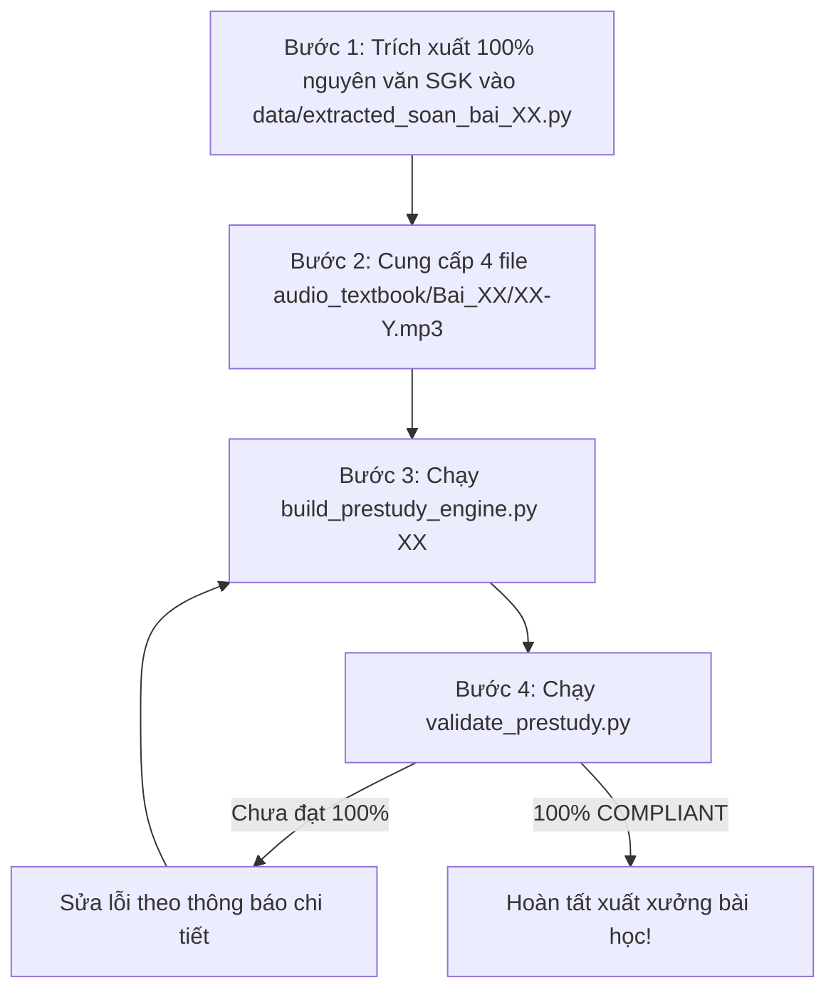

# HSK 3 PRE-STUDY BUILDER SPECIFICATION
## Quy Chuẩn Kỹ Thuật & Sư Phạm Xây Dựng Web Soạn Bài Trước HSK 3

Tài liệu này là **quy chuẩn kỹ thuật, thiết kế giao diện và phương pháp sư phạm bắt buộc** áp dụng cho toàn bộ phân hệ **Web Soạn Bài Trước HSK 3 (Pre-Study Studio)** trong thư mục `2_Web_SoanBai_HSK3/`. 

Toàn bộ quy chuẩn được đúc kết từ phiên bản chuẩn hóa hoàn thiện của **Bài 03** (`2_Web_SoanBai_HSK3/Bai_03/index.html`), kết hợp các bài học xương máu và biện pháp khắc phục triệt để các lỗi kỹ thuật/UX từng xảy ra ở phân hệ Web Luyện Thi.

---

## 1. NGUYÊN TẮC BẤT KHẢ XÂM PHẠM & RANH GIỚI HỆ THỐNG

> [!CRITICAL]
> **1. TUYỆT ĐỐI KHÔNG CAN THIỆP VÀO `1_Web_LuyenThi_HSK3/`:**
> - Mọi file mã nguồn, thư mục, bài thi, âm thanh của Web Luyện Thi phải được giữ nguyên vẹn 100%.
> - Tuyệt đối không chỉnh sửa, di chuyển hay tạo mới file trong `1_Web_LuyenThi_HSK3/`.
> 
> **2. TỰ ĐÓNG GÓI HOÀN TOÀN TRONG `2_Web_SoanBai_HSK3/`:**
> - Tất cả mã nguồn, engine, template, dữ liệu từ vựng, bài khóa, minigame và validator của phân hệ Soạn Bài phải nằm trọn trong thư mục `2_Web_SoanBai_HSK3/`.
> 
> **3. CỔNG TRUNG TÂM (`e:\HSK3\index.html`):**
> - Duy trì giao diện vũ trụ đẳng cấp (Cosmic Obsidian & Royal Amethyst: `#0b0914`, `#1c1836`) với hiệu ứng vầng sáng kép (Dual Aurora: Sapphire bên trái cho Luyện Thi, Amber bên phải cho Soạn Bài).
> - Thẻ Cổng 2 (Web Soạn Bài) luôn mang tone màu Vàng Hổ Phách ấm áp, tách biệt hoàn toàn với màu Xanh Cyan của Cổng 1 (Web Luyện Thi).

---

## 2. CẤU TRÚC THƯ MỤC & PHÂN HỆ FILE CHUẨN

Mỗi thành phần trong phân hệ Web Soạn Bài được tổ chức theo cấu trúc module hóa nghiêm ngặt:

```text
e:\HSK3\2_Web_SoanBai_HSK3/
├── index.html                           # Cổng danh mục 20 bài soạn bài (Dashboard)
├── kiem_tra_tu_vung.html                # Đấu trường kiểm tra từ vựng tích lũy ngẫu nhiên
├── core/
│   ├── template_prestudy_master.html    # Master Template chứa khung HTML, CSS tokens, JS engines
│   ├── build_prestudy_engine.py         # Engine tự động biên dịch dữ liệu bài học thành trang web
│   └── validate_prestudy.py             # Bộ kiểm định chất lượng tự động đạt chuẩn 100% COMPLIANT
├── data/
│   ├── vocab_master.js                  # Kho từ điển từ vựng tích lũy toàn khóa HSK 3 (Bài 1 - 20)
│   ├── extracted_soan_bai_01.py         # Dữ liệu học thuật bài 1
│   ├── extracted_soan_bai_02.py         # Dữ liệu học thuật bài 2
│   ├── extracted_soan_bai_03.py         # Dữ liệu học thuật chuẩn hóa bài 3
│   └── extracted_soan_bai_XX.py         # Dữ liệu học thuật các bài tiếp theo
├── audio_textbook/                      # Thư mục âm thanh MP3 bài khóa chuẩn từ Sách Giáo Khoa
│   ├── 01-1.mp3 ... 01-4.mp3            # 4 bài khóa bài 1
│   ├── 02-1.mp3 ... 02-4.mp3            # 4 bài khóa bài 2
│   ├── 03-1.mp3 ... 03-4.mp3            # 4 bài khóa bài 3
│   └── XX-1.mp3 ... XX-4.mp3            # 4 bài khóa bài XX
└── Bai_XX/                              # Thư mục ứng dụng web của từng bài học
    └── index.html                       # Trang web Single-Page độc lập, tự vận hành hoàn chỉnh
```

---

## 3. QUY CHUẨN DESIGN SYSTEM & TYPOGRAPHY ĐỘ NÉT CAO

Phân hệ Web Soạn Bài mang bản sắc thiết kế **Tươi Sáng - Truyền Cảm Hứng (Sunshine Gold & Golden Amber)**, tạo cảm giác thân thiện, giàu năng lượng khi bắt đầu một bài học mới.

### A. Bảng Màu Thương Hiệu (Design Tokens)
```css
:root {
  --bg: #fffdf5;
  --bg-ambient: radial-gradient(130% 110% at 50% -5%, #fef9c3 0%, #fefce8 30%, #fffdf7 70%, #ffffff 100%);
  --card-bg: rgba(255, 255, 255, 0.96);
  --card-border: rgba(245, 158, 11, 0.28);
  --card-border-glow: rgba(251, 191, 36, 0.55);
  --text-main: #0f172a;        /* Deep Charcoal cho độ tương phản sắc nét */
  --text-sub: #334155;         /* Slate trung tính */
  --text-muted: #64748b;

  /* SUNSHINE GOLD PALETTE */
  --primary: #f59e0b;          /* Vàng ấm áp */
  --primary-bright: #fbbf24;   /* Vàng tươi */
  --primary-yellow: #fde047;
  --primary-vibrant: #eab308;
  --primary-dark: #b45309;     /* Hổ phách đậm nhấn nút */
  --primary-glow: rgba(251, 191, 36, 0.35);
  --primary-light: #fef9c3;
  --primary-soft: #fefce8;

  /* CHINESE TYPOGRAPHY STANDARD */
  --chinese-font: "Noto Sans SC", "PingFang SC", "Microsoft YaHei", sans-serif;
  --zh-title-size: 38px;
  --zh-example-size: 17.5px;
  --zh-dialogue-size: 20px;
  --zh-quiz-size: 17px;
}
```

### B. Quy Chuẩn Phông Chữ Chữ Hán (Typography Standard)
> [!IMPORTANT]
> **BÀI HỌC VỀ ĐỘ RÕ NÉT CỦA HÁN TỰ TRÊN MÀN HÌNH MÁY TÍNH:**
> 1. **TUYỆT ĐỐI TRÁNH** sử dụng các phông chữ serif có nét thanh mảnh (như `Noto Serif SC` loại thường) làm phông chữ chính trên giao diện học tập. Trên màn hình máy tính phổ thông, các nét ngang siêu mảnh (hairline) của chữ Hán phức tạp sẽ bị nhòe hoặc đứt nét, gây mỏi mắt và khó nhận biết chữ.
> 2. **BẮT BUỘC DÙNG** phông Sans-serif hình học hiện đại **`Noto Sans SC`** (Google Fonts với độ đậm `500`, `700`, `900`) để các nét ngang, sổ, phẩy, mác luôn hiển thị đồng đều, sắc cạnh và cực kỳ rõ nét.
> 3. Khai báo import chuẩn tại `<head>`:
>    ```html
>    <link href="https://fonts.googleapis.com/css2?family=Plus+Jakarta+Sans:wght@400;500;600;700;800&family=Noto+Sans+SC:wght@500;700;900&display=swap" rel="stylesheet">
>    ```

### C. Bộ Điều Khiển Cỡ Chữ Toàn Cục (Global Font Scaler)
Tích hợp trực tiếp trên thanh Topbar điều hướng, cho phép người học phóng to toàn bộ chữ Hán trên trang theo 3 cấp độ:
- **`A` (Mặc định)**: Cỡ chữ tiêu chuẩn chống mỏi mắt.
- **`A+` (Lớn)**: Tiêu đề 44px, ví dụ 20px, bài khóa 23px.
- **`A++` (Siêu lớn)**: Tiêu đề 50px, ví dụ 23px, bài khóa 26px.
- **Lưu trữ trạng thái**: Lưu lựa chọn vào `localStorage.getItem('hsk3_font_scale')` để tự động duy trì khi người học tải lại trang hoặc chuyển sang bài khác.

### D. Thẻ Phóng To Siêu Nét (Ultra Focus Modal)
- Container: `#vocabModal` (hiển thị toàn màn hình với nền mờ cao cấp).
- Kích thước Hán tự: **68px** siêu to bản, rõ từng chi tiết nét chữ.
- Hoạt họa nét viết: Khung **HanziWriter 100x100px** hiển thị từng nét vẽ theo đúng quy tắc bút thuận.
- Đầy đủ thông tin: Pinyin, Âm Hán Việt, Từ loại, Chiết tự, 2 câu ví dụ ngữ cảnh, kiến thức mở rộng.
- Hỗ trợ phím tắt bàn phím:
  - `Phím ESC`: Đóng modal tức thì.
  - `Mũi tên Phải (➔)`: Chuyển sang từ vựng tiếp theo.
  - `Mũi tên Trái (⬅)`: Lùi về từ vựng trước đó.
  - `Phím Space`: Phát lại âm thanh phát âm chuẩn bản xứ.

---

## 4. CHI TIẾT 4 TAB & CÁC SUBTAB TRỌNG TÂM MỖI BÀI HỌC

Giao diện học tập được chia thành 4 Tab chính với thanh chuyển Tab gắn biểu tượng trực quan:

```html
<div class="tabs-nav">
  <button class="tab-btn active" onclick="switchTab('tab-vocab')">📚 1. Từ Vựng &amp; Chiết Tự</button>
  <button class="tab-btn" onclick="switchTab('tab-games')">🃏 2. Flashcard &amp; Minigames</button>
  <button class="tab-btn" onclick="switchTab('tab-dialogues')">📖 3. Mổ Xẻ 4 Bài Khóa SGK</button>
  <button class="tab-btn" onclick="switchTab('tab-grammar')">📐 4. Xưởng Ngữ Pháp &amp; Mini Quiz</button>
</div>
```

---

### TAB 1: 📚 TỪ VỰNG & CHIẾT TỰ BÚT THUẬN (`#tab-vocab`)

> [!CRITICAL]
> **NGUYÊN TẮC VÀNG: 100% TỪ VỰNG TRÍCH XUẤT TỪ SÁCH GIÁO KHOA GỐC (GROUND TRUTH):**
> 1. **Nguồn tham chiếu duy nhất**: Toàn bộ danh sách từ mới (Hán tự, Pinyin, Từ loại, Nghĩa gốc tiếng Việt) **BẮT BUỘC ĐỐI CHIẾU TRỰC TIẾP VỚI BẢNG "生词" (TỪ MỚI)** nằm ở cột bên phải các bài khóa trong `FILE TÀI LIỆU/HSK 3 Sách giáo khoa.pdf`.
> 2. **Tuyệt đối KHÔNG ĐƯỢC BỎ SÓT TỪ**: Mọi từ trong bảng 生词 của SGK đều phải được đưa vào danh sách từ vựng (ví dụ: Bài 01 có đủ 15 từ kể cả `搬 bān`, Bài 02 có đủ 18 từ kể cả `疼 téng` và `瘦 shòu`).
> 3. **Tuyệt đối KHÔNG LẪN CỤM NGỮ PHÁP HOẶC TỪ BÀI KHÁC**: Không tự ý biến các cấu trúc ngữ pháp (như `一点儿`, `得多`) thành thẻ từ vựng; không đưa từ của bài trước vào bài sau (như `胖` vốn của Bài 2 không được đưa vào Bài 5).
> 4. **Bảng số lượng từ vựng chuẩn SGK (Reference Ground Truth)**:
>    - **Bài 01**: 15 từ | **Bài 02**: 18 từ | **Bài 03**: 17 từ | **Bài 04**: 16 từ | **Bài 05**: 13 từ
>    - **Bài 06**: 15 từ | **Bài 07**: 12 từ | **Bài 08**: 17 từ | **Bài 09**: 13 từ | **Bài 10**: 15 từ
> 5. **Đồng bộ toàn diện**: Dữ liệu từ vựng phải được đồng bộ song song ở 3 nơi:
>    - File dữ liệu bài học: `2_Web_SoanBai_HSK3/data/extracted_soan_bai_XX.py`
>    - Trang web bài học: `2_Web_SoanBai_HSK3/Bai_XX/index.html` (thẻ `.vocab-card`, flashcard, game nối từ, xưởng ghép chữ)
>    - Kho từ điển tổng: `2_Web_SoanBai_HSK3/data/vocab_master.js` (phục vụ đấu trường từ vựng)

#### A. Cấu Trúc Mỗi Thẻ Từ Vựng
Mỗi từ mới trong SGK được đóng gói trong một thẻ Glassmorphism (`.vocab-card`):
1. **Hán tự hiển thị to bản**: Font `Noto Sans SC` đậm nét, bấm trực tiếp vào Hán tự hoặc nút `🔍 Phóng to` sẽ mở Ultra Focus Modal.
2. **Hệ thống Pinyin & Hán Việt**: Đặt liền kề, sắc nét.
3. **Badge Từ Loại Chuyên Biệt**: Màu nền phân biệt theo từ loại:
   - *Danh từ*: Nền xanh ngọc `#ecfdf5`, chữ xanh `#065f46`.
   - *Động từ*: Nền cam ấm `#fff7ed`, chữ cam đậm `#9a3412`.
   - *Tính từ*: Nền tím `#faf5ff`, chữ tím `#6b21a8`.
   - *Liên từ*: Nền vàng `#fefce8`, chữ nâu vàng `#854d0e`.
   - *Phó từ*: Nền lam nhạt `#f0f9ff`, chữ lam `#075985`.
   - *Lượng từ*: Nền hồng đào `#fff1f2`, chữ đỏ sẫm `#9f1239`.
4. **Chiết Tự Bộ Thủ (Accordion)**: Đóng khung trong `<details class="vocab-details">` giải thích nguồn gốc các bộ thủ cấu tạo nên chữ Hán và mẹo ghi nhớ hình ảnh.
5. **2 Câu Ví Dụ Ngữ Cảnh**:
   - Câu 1: Giao tiếp đời sống thực tế, gần gũi.
   - Câu 2: Trích dẫn cấu trúc ngữ pháp tương tự đề thi HSK.
   - Đầy đủ 3 dòng: Chữ Hán, Phiên âm Pinyin, Dịch nghĩa tiếng Việt.
6. **Mục Kiến Thức Mở Rộng (`expansion`)**: Cung cấp các cụm từ cố định, cấu trúc đi kèm hoặc thành ngữ thông dụng.
7. **Khung Hoạt Họa Bút Thuận (HanziWriter)**:
   - Nút `▶ Xem thứ tự nét`: Khi click sẽ gọi thư viện HanziWriter vẽ từng nét chữ Hán.
   - Nút `🔄 Chạy lại nét` và `✖ Đóng` để chủ động điều khiển.

---

### TAB 2: 🃏 FLASHCARD 3D & 🎮 MINIGAMES GHI NHỚ HÁN TỰ (`#tab-games`)

Tab 2 bao gồm **3 Subtab** chuyên biệt giúp chuyển hóa từ vựng từ trí nhớ ngắn hạn sang trí nhớ dài hạn:

#### Subtab 1: Flashcard 3D Lật Thẻ (`#subtab-flashcard`)
- **Hiệu ứng xoay 3D (CSS `transform: rotateY(180deg)`)**:
  - Mặt trước: Từ loại, Chữ Hán to bản, Nút nghe phát âm chuẩn TTS.
  - Mặt sau: Phiên âm Pinyin, Âm Hán Việt, Ý nghĩa tiếng Việt, Câu ví dụ ngữ cảnh.
- **Thao tác nhanh**:
  - Click chuột hoặc chạm tay vào thẻ để lật.
  - Phím `Space`: Lật thẻ.
  - Phím `Mũi tên Trái / Phải`: Chuyển lùi / tiếp từ vựng.
- **Bộ đếm tiến độ**: Hiển thị rõ số thứ tự hiện tại (ví dụ: `3 / 17`).

#### Subtab 2: Game Nối Từ 2 Cột Chữ Hán ↔ Tiếng Việt (`#subtab-matching`)
- **Cột trái**: Danh sách Chữ Hán được xáo trộn ngẫu nhiên. Mặc định **ẩn Pinyin** để luyện nhận diện mặt chữ, có nút bấm `👁 Hiện Pinyin / 🙈 Ẩn Pinyin` hỗ trợ.
- **Cột phải**: Danh sách Ý nghĩa Tiếng Việt được xáo trộn độc lập.
- **Quy tắc căn chỉnh chiều cao**: Đặt chiều cao dòng cố định (flexbox hoặc grid với `min-height`) để 2 cột luôn song hành thẳng tắp, không bị lệch hàng do câu tiếng Việt dài ngắn khác nhau.
- **Phản hồi âm thanh & thị giác**:
  - Ghép đúng: Phát âm thanh "Ting" (Web Audio API), đổi sang nền xanh lục `#10b981`, khóa thẻ thành công.
  - Ghép sai: Phát âm thanh cảnh báo "Buzzer", rung lắc đỏ (`shake-error`) và tự động nhả chọn sau 500ms.
- **Bảng thống kê**: Đếm thời gian thực `⏱ 00:00`, đếm số lượt click `🎯 Lượt chọn`, và số cặp đã ghép thành công `✅ 17 / 17`.

#### Subtab 3: Xưởng Ghép Chữ Hán (Radical Lego Studio - `#subtab-assembly`)
> [!TIP]
> **MINIGAME ĐẶC TRỊ GHI NHỚ MẶT CHỮ HÁN:**
> Thay vì chép phạt cơ học, người học được vào vai một "kỹ sư chế tác chữ Hán", tự tay lựa chọn các mảnh ghép bộ thủ trong kho linh kiện để lắp ráp thành chữ Hán theo nghĩa và pinyin yêu cầu.

- **Cấu trúc 1 lượt chơi**:
  1. *Nhiệm vụ*: Hiển thị ý nghĩa tiếng Việt mục tiêu + Pinyin gợi ý (Ví dụ: "Hay là, hoặc là" - `Pinyin: hái`).
  2. *Bàn ghép linh kiện (`#asmSlotsContainer`)*: Các ô trống dạng `[ Ô 1 ] + [ Ô 2 ] ➔ [ ? ]`. Bấm vào linh kiện dưới kho để đưa vào ô ghép; bấm vào ô ghép để tháo gỡ linh kiện ra.
  3. *Kho linh kiện bộ thủ (`#asmPoolGrid`)*: Chứa các bộ thủ chính xác tạo nên chữ + các linh kiện bẫy (distractors) có hình thái tương tự. Mỗi nút linh kiện hiển thị Chữ bộ thủ to + Tên tiếng Việt của bộ thủ.
  4. *Khung chúc mừng & giải mã chiết tự (`#asmSuccessBox`)*: Khi ghép đúng, mở ra thẻ chúc mừng hiển thị Chữ Hán to, Audio phát âm, Câu chuyện chiết tự logic và Câu ví dụ mẫu.
- **Thuật toán xáo trộn Fisher-Yates (`shuffleArray`)**:
  - Xáo trộn ngẫu nhiên thứ tự toàn bộ các câu đố ghép chữ mỗi khi bắt đầu chơi hoặc bấm chơi lại.
  - Xáo trộn ngẫu nhiên vị trí các mảnh linh kiện trong kho linh kiện của từng câu đố để chống học vẹt vị trí.
- **Kiến trúc phân tách khu vực Replay**:
  - Tách biệt rõ ràng `#asmPlayArea` (khu vực bàn ghép và kho linh kiện) và `#asmVictoryView` (màn hình vinh danh khi hoàn thành).
  - Khi hoàn tất, chỉ ẩn `#asmPlayArea` và hiện `#asmVictoryView`.
  - Khi bấm `🔄 Thử Thách Lại Lần Nữa`, chỉ đảo trạng thái hiển thị và gọi `initAssemblyGame()`, **tuyệt đối không ghi đè `innerHTML`** phá hủy cấu trúc DOM.

---

### TAB 3: 📖 MỔ XẺ 4 BÀI KHÓA SGK & 🎙️ AI SHADOWING (`#tab-dialogues`)

> [!CRITICAL]
> **NGUYÊN TẮC VÀNG BẮT BUỘC: 100% NGUYÊN VĂN TỪ SÁCH GIÁO KHOA GỐC (GROUND TRUTH):**
> 1. **Nguồn tham chiếu duy nhất**: Toàn bộ nội dung 4 bài khóa (tiêu đề, địa điểm bối cảnh, từng câu thoại chữ Hán, nhân vật, phiên âm Pinyin) **BẮT BUỘC TRÍCH XUẤT NGUYÊN VĂN 100% TỪ FILE PDF SGK** (`e:\HSK3\FILE TÀI LIỆU\HSK 3 Sách giáo khoa.pdf`).
> 2. **Tuyệt đối KHÔNG ĐƯỢC TỰ BỊA / SÁNG TÁC / VIẾT LẠI**: Không được tự tạo hội thoại mẫu dựa theo từ vựng hoặc cắt xén câu chữ trong sách. Học viên học theo giáo trình chính thức cần sự chuẩn xác tuyệt đối từng nét chữ, từng dấu phẩy, từng danh xưng nhân vật (như 小刚, 小丽, 周明, 周太太, 马可, 经理, 服务员, 同学...).
> 3. **Audio chuẩn sách giáo khoa (Đồng bộ từng từ)**: File nghe `<audio src="../audio_textbook/Bai_XX/XX-Y.mp3"></audio>` phải trích từ kho audio chính thức của giáo trình HSK 3 (tải từ Google Drive). Mỗi file MP3 tương ứng trọn vẹn với 1 bài khóa. Học viên vừa nghe audio chuẩn bản xứ vừa nhìn chữ trên màn hình và luyện đọc nhại giọng (Shadowing) mà không có bất kỳ sự lệch pha nào!

#### A. Cấu Trúc Mỗi Bài Khóa
Mỗi bài học HSK 3 bao gồm đúng 4 bài khóa tương ứng với 4 bối cảnh giao tiếp trong SGK:
1. **Tiêu đề & Địa điểm**: Ghi rõ ngữ cảnh (Ví dụ: *Bài Khóa 1: 在小丽家 (Ở nhà chị Lệ)*).
2. **Audio Sách Giáo Khoa Thật**:
   - Thẻ `<audio controls preload="none" src="../audio_textbook/Bai_XX/XX-Y.mp3"></audio>` trỏ chính xác đến file MP3 gốc trích từ đĩa giáo trình HSK 3.
   - Bắt buộc kiểm tra file vật lý tồn tại trên ổ đĩa và dung lượng > 5KB.
3. **Mô tả bối cảnh**: Giúp người học hình dung tình huống giao tiếp thực tế trước khi đọc.
4. **Bóc tách từng câu thoại (`.d-line`)**:
   - Người nói (kèm icon 👤 và tên nhân vật theo đúng SGK).
   - Nút `🔊 Nghe câu`: Phát âm câu thoại đó thông qua Web Speech API (TTS).
   - Chữ Hán chuẩn: Cỡ chữ 20px sắc nét, font `Noto Sans SC`.
   - Phiên âm Pinyin đầy đủ thanh điệu theo đúng bản in SGK.
   - Dịch nghĩa tiếng Việt tự nhiên, sát ngữ cảnh bài học.
   - Phân tích ngữ pháp / thành phần câu: Bóc tách từ ngữ trọng điểm, trợ từ ngữ khí (`了`, `着`, `过`, `吧`, `呢`...) hoặc bổ ngữ xu hướng / kết quả.
5. **Công Nghệ Luyện Phát Âm AI Shadowing**:
   - Tích hợp Web Speech API (`SpeechRecognition` / `webkitSpeechRecognition`).
   - Ngôn ngữ nhận diện: `zh-CN`.
   - Thuật toán so khớp: Làm sạch chuỗi mẫu và chuỗi nhận diện được (loại bỏ toàn bộ dấu câu `，。？！` và khoảng trắng), tính tỷ lệ % trùng khớp ký tự.
   - Phản hồi trực quan:
     - Đang nghe: Nút chuyển sang trạng thái nhấp nháy đỏ `🔴 Đang nghe... Hãy nói ngay`.
     - Kết quả: Hiển thị badge độ chính xác `%` kèm câu chữ Hán trình duyệt nghe được (Xanh lá nếu $\ge 70\%$, Vàng nếu $< 70\%$).
     - Xử lý lỗi mượt mà: Báo lỗi thân thiện nếu chưa cấp quyền Micro (`not-allowed`) hoặc không nghe thấy tiếng (`no-speech`).
6. **Câu Hỏi Đọc Hiểu Bài Khóa (Comprehension Check Quiz)**:
   - 1 câu hỏi trắc nghiệm kiểm tra khả năng nắm bắt thông tin cốt lõi của bài khóa.
   - Chọn phương án và bấm kiểm tra đáp án tức thì kèm lời giải thích chi tiết trích dẫn từ bài khóa.

---

### TAB 4: 📐 XƯỞNG NGỮ PHÁP & MINI QUIZ (`#tab-grammar`)

#### A. Cấu Trúc Từng Trọng Điểm Ngữ Pháp
Mỗi điểm ngữ pháp trọng tâm HSK 3 được bóc tách theo quy trình 4 bước:
1. **Công Thức Vàng Đóng Khung (`.grammar-formula`)**:
   - Trình bày công thức cô đọng, dễ nhớ (Ví dụ: `Nơi chốn + Động từ + 着 (zhe) + Cụm danh từ`).
2. **Phân Tích Bản Chất & Quy Tắc Then Chốt**:
   - Giải thích bản chất tư duy ngôn ngữ của người Trung Quốc, tránh dịch theo lối mòn từ ngữ tiếng Việt.
   - Bảng so sánh trực quan (Ví dụ: Bảng phân biệt `还是` dùng cho câu hỏi/phân vân vs `或者` dùng cho câu khẳng định).
3. **Câu Ví Dụ Thực Hành**:
   - Cung cấp ít nhất 3 câu ví dụ kinh điển có Pinyin và dịch nghĩa rõ ràng.
4. **Cảnh Báo Bẫy Đề Thi HSK (`.grammar-traps`)**:
   - Đóng khung cảnh báo màu vàng viền cam các lỗi sai mà người học Việt Nam thường mắc phải trong bài thi HSK.

#### B. Mini Quiz Kiểm Tra Nhanh Ngữ Pháp
- Gồm 5 câu hỏi trắc nghiệm được biên soạn bám sát cấu trúc đề thi HSK 3 thực tế.
- **Có đầy đủ Pinyin và Dịch nghĩa** cho cả câu hỏi lẫn 4 phương án A, B, C, D.
- Nút bấm `👁 Dịch câu này` trên từng câu và `👁 Hiện / Ẩn Toàn Bộ Dịch Nghĩa` cho phép người học chủ động ẩn bản dịch để tự thử thách bản thân trước khi xem gợi ý.
- Chọn phương án -> Bấm `Kiểm tra kết quả` -> Hộp giải thích (`.quiz-explain`) lập tức hiển thị đáp án đúng và phân tích lý do ngữ pháp tại sao chọn phương án đó.

---

### PHÂN HỆ PHỤ TRỢ: ĐẤU TRƯỜNG KIỂM TRA TỪ VỰNG TÍCH LŨY (`kiem_tra_tu_vung.html`)

Đây là trung tâm kiểm tra tổng hợp từ vựng độc lập nằm ở thư mục gốc `2_Web_SoanBai_HSK3/`:
- **Nguồn dữ liệu**: Đọc tập trung từ `data/vocab_master.js`.
- **Bộ lọc đa bài học**: Danh sách Checkbox cho phép người học chọn bất kỳ tổ hợp bài nào đã học (ví dụ: chỉ kiểm tra Bài 1 + Bài 2 + Bài 3, hoặc toàn bộ 20 bài).
- **4 Chế Độ Đấu Trường Đa Dạng**:
  1. `🇻🇳 ➔ 🇨🇳`: Đọc nghĩa tiếng Việt -> Chọn chữ Hán tương ứng.
  2. `🇨🇳 ➔ 🇻🇳`: Đọc chữ Hán -> Chọn nghĩa tiếng Việt chính xác.
  3. `🔤 ➔ 🇻🇳`: Đọc phiên âm Pinyin -> Chọn nghĩa tiếng Việt.
  4. `🎲 Hỗn hợp`: Xáo trộn ngẫu nhiên cả 3 chế độ trên để rèn luyện phản xạ toàn diện.
- **Thống Kê Điểm Số & Sổ Tay Ôn Lại**: Phân loại kết quả (Xuất sắc / Tốt / Cần cố gắng) và liệt kê danh sách các từ trả lời sai để luyện tập lại.

---

## 5. BẢNG TỔNG HỢP CÁC LỖI TỪNG MẮC PHẢI & BÀI HỌC KINH NGHIỆM XƯƠNG MÁU

Để đảm bảo các bài học tiếp theo (Bài 4 đến Bài 20) luôn đạt chất lượng hoàn mỹ và không bao giờ tái diễn lỗi, tất cả các tác nhân phát triển phải tuân thủ nghiêm ngặt bảng bài học kinh nghiệm sau:

| STT | Tên Lỗi / Anti-Pattern | Hiện Tượng & Hậu Quả | Quy Tắc Khắc Phục Triệt Để |
| :--- | :--- | :--- | :--- |
| **1** | **Trùng lặp Menu Điều Hướng (Menu Duplication)** | Trong Web Luyện Thi cũ, các nút quay lại, chọn bài học bị đặt trùng lặp ở cả Header, Topbar và Body, làm rối mắt người học và dễ desync trạng thái. | **Chỉ duy nhất 1 thanh `.topbar-nav`** ở đầu trang. Thanh này chứa đầy đủ: Nút về Cổng Tổng, Danh mục bài học, **Cụm chuyển nhanh bài học (`◀ Bài trước` / Dropdown 20 bài / `Bài tiếp ▶`)**, Bộ chỉnh cỡ chữ Hán (`A / A+ / A++`), Nút sang Đấu trường từ vựng và Nút 1-click chuyển sang Web Luyện Thi. Tuyệt đối không tạo menu thứ hai. |
| **2** | **Chữ Hán mờ nhòe trên màn hình LCD (Thin Serif Blurring)** | Sử dụng phông có chân nét mảnh (`Noto Serif SC` regular) khiến nét ngang bị mờ hoặc biến mất trên màn hình LCD laptop/PC. | **BẮT BUỘC dùng `Noto Sans SC`** (weights 500, 700, 900) với kích thước chữ Hán tối ưu (Tiêu đề 38px, Ví dụ 17.5px, Bài khóa 20px). Tích hợp thêm **Global Font Scaler** (`A / A+ / A++`) và **Ultra Focus Modal** 68px. |
| **3** | **Lỗi ghi đè DOM làm hỏng Replay (DOM Overwrite Bug)** | Khi người dùng hoàn thành Minigame và bấm "Chơi lại", mã nguồn cũ thực hiện `container.innerHTML = victoryHTML`, làm xóa sạch bàn ghép linh kiện và event listener, khiến nút chơi lại bị liệt. | **Tách biệt hoàn toàn 2 container độc lập**: `#asmPlayArea` (khu vực chơi) và `#asmVictoryView` (màn hình chiến thắng). Khi thắng hoặc chơi lại, chỉ chuyển đổi `style.display = 'block' / 'none'`, tuyệt đối không ghi đè innerHTML của thẻ cha. |
| **4** | **Lệch hàng trong Game Nối từ 2 cột (Desynced Heights)** | Cột chữ Hán ngắn (1 dòng) trong khi cột tiếng Việt dài (2-3 dòng) làm các ô bị lệch độ cao, giao diện xô lệch gây khó nhìn. | **Đặt độ cao hàng đồng bộ cố định** (CSS Grid `grid-auto-rows: 66px` hoặc flexbox min-height đồng đều) kết hợp flexbox căn giữa dọc (`align-items: center`), đảm bảo mọi cặp thẻ luôn thẳng hàng đối xứng. |
| **5** | **Truyền chuỗi có dấu nháy vào `onclick` (SyntaxError Crash)** | Đưa trực tiếp câu thoại tiếng Trung hoặc tiếng Việt chứa dấu nháy đơn/kép vào HTML `onclick="checkSomething('anh ấy nói: 'xin chào'')"` gây lỗi cú pháp Javascript, làm nút bấm bị tê liệt hoàn toàn. | **Chỉ truyền chỉ số index hoặc ID số nguyên** vào hàm `onclick="selectItem(idx)"`. Hàm JS sẽ tự tra cứu thông tin từ mảng dữ liệu gốc. Nếu bắt buộc truyền chuỗi, phải escape triệt để (`replace(/'/g, "\\'")`). |
| **6** | **Bài tập tĩnh dẫn đến học vẹt vị trí (Static Ordering)** | Thứ tự câu hỏi và vị trí các đáp án/linh kiện cố định qua các lần chơi, khiến người học nhớ vị trí bấm chuột thay vì nhớ mặt chữ và kiến thức. | **Áp dụng thuật toán xáo trộn ngẫu nhiên Fisher-Yates (`shuffleArray`)** cho cả danh sách câu hỏi lẫn vị trí các mảnh linh kiện bộ thủ trong kho mỗi khi khởi tạo hoặc bắt đầu ván mới. |
| **7** | **Nhầm lẫn nhận diện thị giác giữa 2 web (Color Confusion)** | Web Soạn Bài dùng màu xanh cyan trùng với Web Luyện Thi, khiến người học không phân biệt được mình đang ở giai đoạn Soạn bài hay Luyện thi. | **Phân định dứt khoát bản sắc thị giác**: Web Luyện Thi là Dark Cyan / Obsidian Blue (`#0b1220`, `#38bdf8`), Web Soạn Bài là Sunshine Gold / Warm Amber (`#fffdf5`, `#f59e0b`, `#fbbf24`), Cổng Tổng là Cosmic Obsidian & Royal Amethyst. |
| **8** | **Xâm lấn thư mục Web Luyện Thi (Boundary Violation)** | Vô tình tạo hoặc chỉnh sửa file trong `1_Web_LuyenThi_HSK3/` làm sai lệch cấu trúc chuẩn đã hoàn thiện của phân hệ Luyện Thi. | **Thiết lập ranh giới bất khả xâm phạm**: Mọi script build và thao tác file chỉ được phép tác động trong phạm vi thư mục `2_Web_SoanBai_HSK3/`. |
| **9** | **Tự ý bịa / sinh sai bài khóa & lệch file Audio (Dialogue Hallucination & Audio Desync)** | Tự ý sáng tác hội thoại mẫu hoặc tóm tắt bài khóa không khớp SGK gốc `HSK 3 Sách giáo khoa.pdf`. Hậu quả: Câu chữ hiển thị trên web một đằng, audio đĩa giáo trình (Google Drive) đọc một nẻo, làm hỏng hoàn toàn trải nghiệm luyện nghe và tính sư phạm của bài học! | **TUYỆT ĐỐI KHÔNG BỊA BÀI KHÓA**: Mọi câu thoại chữ Hán, nhân vật, Pinyin bắt buộc đối chiếu trực tiếp và trích xuất nguyên văn 100% từ trang PDF sách giáo khoa. File audio `<audio src="../audio_textbook/Bai_XX/XX-Y.mp3"></audio>` phải trỏ chuẩn xác đến file MP3 cắt theo bài khóa từ kho Google Drive, đảm bảo nghe chuẩn từng âm tiết. |
| **10** | **Thiếu / Thừa / Lệch danh sách Từ vựng chuẩn SGK (Vocabulary Divergence)** | Tự ý lược bỏ từ mới ở cuối bài (như bỏ sót `搬` Bài 1, `疼` & `瘦` Bài 2), nhặt thừa từ bài khác sang (như `胖` ở Bài 5), hoặc lẫn cấu trúc ngữ pháp vào bảng từ vựng (như lẫn `一点儿`, `得多` ở Bài 10). | **BẮT BUỘC ĐỐI CHIẾU 100% VỚI BẢNG 生词 CỘT PHẢI SGK**: Đúng chính xác tuyệt đối cả về số lượng từ (Reference Ground Truth), thứ tự từ, Hán tự, Pinyin và phân loại từ loại. Bộ validator `validate_prestudy.py` sẽ tự động chặn xuất xưởng nếu số thẻ từ vựng không khớp chính xác với chuẩn SGK. |
| **11** | **Điều hướng bài học rời rạc / Vi phạm Single Topbar (Navigation Inconsistency)** | Tự ý thêm thanh điều hướng phụ ở chân trang hoặc làm tràn giao diện gây vi phạm quy tắc Single Topbar Rule; không xử lý điều kiện biên đầu cuối của danh mục bài học. | **BẮT BUỘC TÍCH HỢP CỤM ĐIỀU HƯỚNG NHANH TRÊN TOPBAR DUY NHẤT**: Tích hợp cụm `nav-center` trên thanh `.topbar-nav` gồm nút `◀ Bài trước`, hộp chọn xổ nhanh 20 bài `select`, và nút `Bài tiếp ▶`. Xử lý chặt chẽ điều kiện biên (Bài 01 vô hiệu hóa nút lùi, Bài 20 vô hiệu hóa nút tiến). |

---

## 6. QUY TRÌNH BIÊN DỊCH & KIỂM ĐỊNH TỰ ĐỘNG (PIPELINE)

Mỗi khi xây dựng bài học mới (ví dụ Bài 4, Bài 5...) hoặc cập nhật bài học hiện tại, quy trình thực hiện gồm 4 bước chuẩn hóa:



### Bước 1: Soạn dữ liệu bài học (`data/extracted_soan_bai_XX.py`)
File dữ liệu bài học phải chứa từ điển `LESSON_DATA` với đầy đủ các khóa:
- `lesson_info`: `id`, `title_zh`, `title_py`, `title_vi`, `subtitle`, `exam_web_url`.
- `vocab`: Danh sách từ mới đầy đủ chuẩn SGK (kèm `radicals`, `stroke_info`, `eg1`, `eg2`, `expansion`).
- `matching_pairs`: Danh sách cặp chữ Hán - tiếng Việt cho minigame nối từ.
- `assembly_puzzles`: Danh sách câu đố chiết tự cho minigame Xưởng Ghép Chữ Hán (nếu chưa soạn kịp, engine sẽ tự động sinh fallback thông minh từ danh sách từ vựng).
- `dialogues`: **BẮT BUỘC 4 bài khóa trích xuất nguyên văn 100% từ `FILE TÀI LIỆU/HSK 3 Sách giáo khoa.pdf`**, gồm:
  - `num`: Thứ tự bài khóa (1 đến 4).
  - `title`: Tiêu đề tiếng Trung + tiếng Việt (theo tiêu đề bối cảnh trong SGK).
  - `location`: Địa điểm diễn ra hội thoại.
  - `audio_file`: Trỏ tới `audio_textbook/Bai_XX/XX-Y.mp3`.
  - `context`: Tóm tắt ngắn gọn ngữ cảnh giao tiếp.
  - `lines`: Danh sách từng lượt thoại với `speaker` (tên nhân vật), `role` (male/female), `zh` (chữ Hán chuẩn SGK), `py` (Pinyin chuẩn SGK), `vi` (bản dịch tiếng Việt chuẩn xác), `analysis` (bóc tách từ vựng & ngữ pháp trọng điểm).
  - `check_question`: 1 câu hỏi đọc hiểu kèm 4 phương án trắc nghiệm, đáp án và giải thích.
- `grammar`: Các trọng điểm ngữ pháp với công thức, quy tắc, bảng so sánh và bẫy đề thi.
- `mini_quiz`: 5 câu trắc nghiệm ngữ pháp có Pinyin và bản dịch đầy đủ.

### Bước 2: Cung cấp file âm thanh bài khóa (`audio_textbook/`)
Đặt 4 file MP3 bài khóa của bài học vào thư mục `2_Web_SoanBai_HSK3/audio_textbook/Bai_XX/` theo định dạng tên: `XX-1.mp3`, `XX-2.mp3`, `XX-3.mp3`, `XX-4.mp3`. Các file này được trích xuất từ đĩa nghe giáo trình HSK 3 chính thức (tải từ kho Google Drive).

### Bước 3: Biên dịch bài học bằng Engine tự động
Chạy lệnh biên dịch tại thư mục gốc:
```powershell
python 2_Web_SoanBai_HSK3/core/build_prestudy_engine.py XX
```
Engine sẽ tự động nạp `template_prestudy_master.html`, sinh toàn bộ mã HTML/CSS/JS, biên dịch thành công file `2_Web_SoanBai_HSK3/Bai_XX/index.html` và tự động kích hoạt bộ validator.

### Bước 4: Kiểm định tự động với `validate_prestudy.py`
Chạy bộ kiểm định độc lập để rà soát toàn bộ các tiêu chuẩn kỹ thuật:
```powershell
python 2_Web_SoanBai_HSK3/core/validate_prestudy.py 2_Web_SoanBai_HSK3/Bai_XX/index.html
```

> [!CHECK]
> **ĐIỀU KIỆN HOÀN TẤT:**  
> Bài học chỉ được coi là hoàn tất khi terminal in ra thông báo:  
> `🎉 ALL PRE-STUDY CHECKS PASSED (100% COMPLIANT)!`  
> không còn bất kỳ cảnh báo hoặc lỗi nào tồn đọng.
